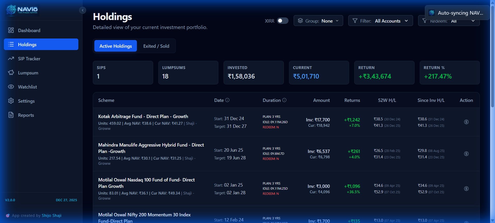
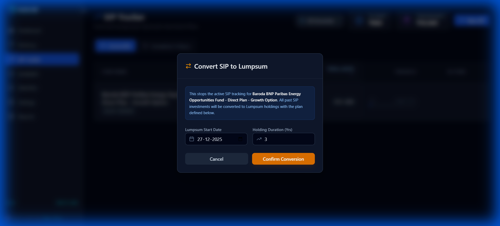
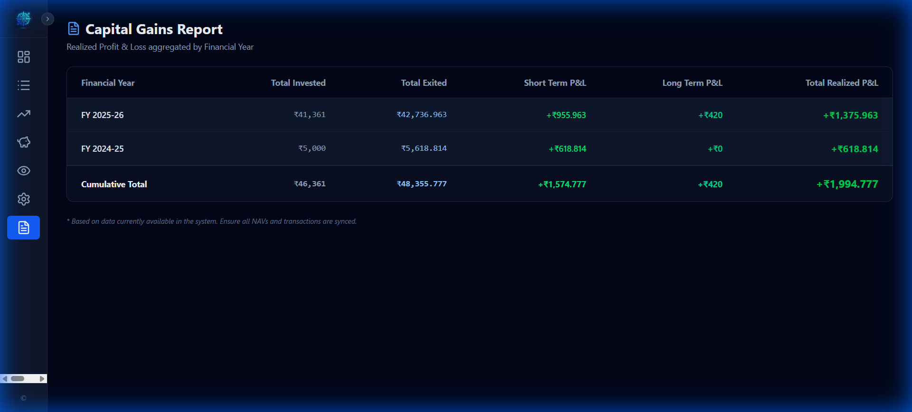
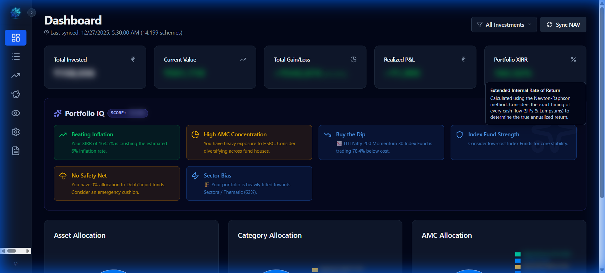

# NAViō v2.0.0 Walkthrough - "The Strategic Release" 🚀

This walkthrough demonstrates the major features introduced in version 2.0.0, focusing on lifecycle management, strategic planning, and enhanced reporting.

## 📺 Application Overview Video
The following recording shows a complete journey through the application, highlighting the key updates.

> Values are for reference purpose only

---

## 🛠️ Key Features Highlight

### 1. Dynamic Dashboard & Portfolio IQ
The dashboard provides a high-level view of your wealth with real-time KPI updates and strategic insights.

### 2. Strategic Holdings Tracking
We've introduced labels for **"Start"** and **"Target"** dates to align with your investment plans. Notice the **"Idle"** age tracking remains accurate behind the scenes.

### 3. SIP to Lumpsum Conversion
The marquee feature of v2.0.0. Migrate matured strategies into lumpsum holdings with a custom start date and duration baseline.

### 4. Advanced Capital Gains Reporting
Enhanced transparency with dedicated **"Invested"** and **"Exited"** value columns for every realized transaction.

### 5. Hardened Privacy Mode
Demonstrating the deep blurring of sensitive data across charts, tables, and account details.

---

## 🏁 Summary
Version 2.0.0 marks the transition of NAViō into a professional-grade portfolio management suite. From automated NAV syncing to strategic lifecycle conversion, every feature is designed for depth and durability.
